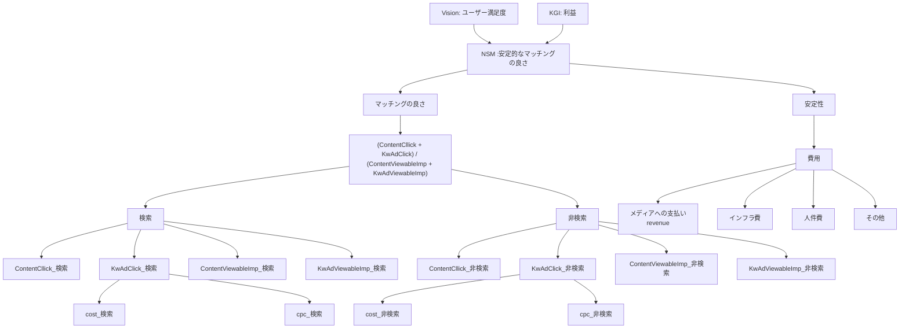

検索をさせないで、レコメンデーションさせる  
検索クエリはあまり増えないかもしれないが、レコメンデーションが発達すれば、  
そのレコメンデーションの根拠が検索クエリと同様に世の中の需要と考えられる。  
費用を安定性という形で登場させるか？  
ContentClickはその後の検索や広告クリックに繋がっていくだろうから、利益には貢献しそう。  
だがしかし、小出さんが指摘していた循環にならないようにツリー状で表現できるか？
  

