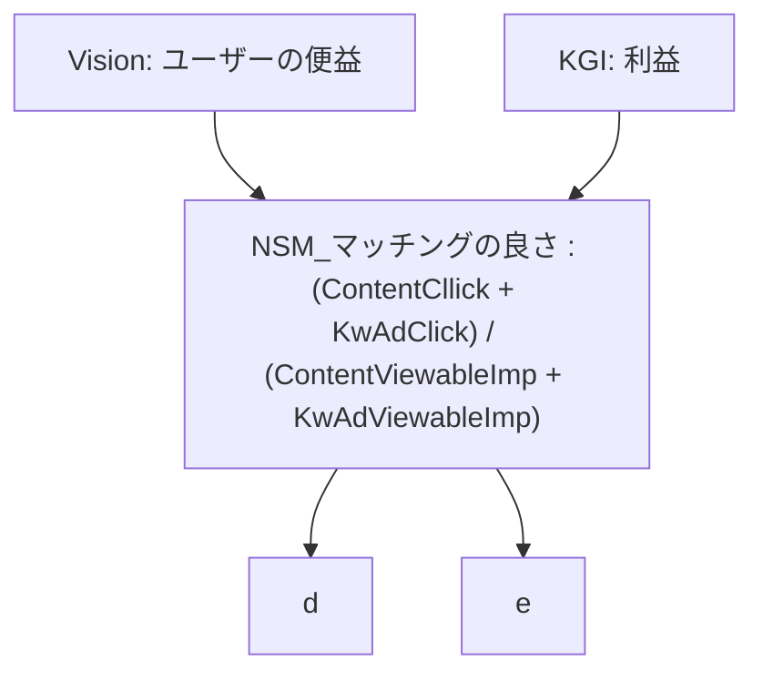

```mermaid
flowchart TB
    
    a["Vision: ユーザーの便益"] --> c["NSM_マッチングの良さ : (ContentCllick + KwAdClick) / (ContentViewableImp + KwAdViewableImp)  "]
    b["KGI: 利益"]--> c
    c --> d
    c --> e
    
```

