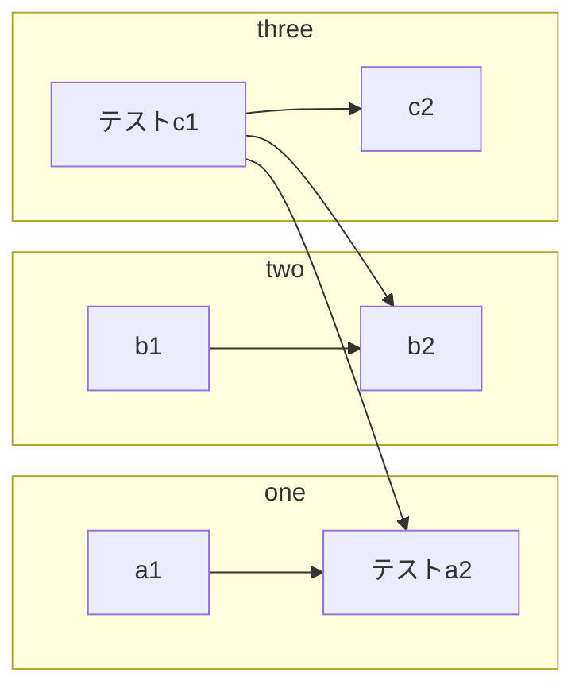

```mermaid
flowchart LR

    c1[テストc1]-->a2[テストa2]
    c1-->b2
    
    subgraph one
    a1-->a2
    end
    
    subgraph two
    b1-->b2
    end
    
    subgraph three
    c1-->c2
    end
    
    

```
